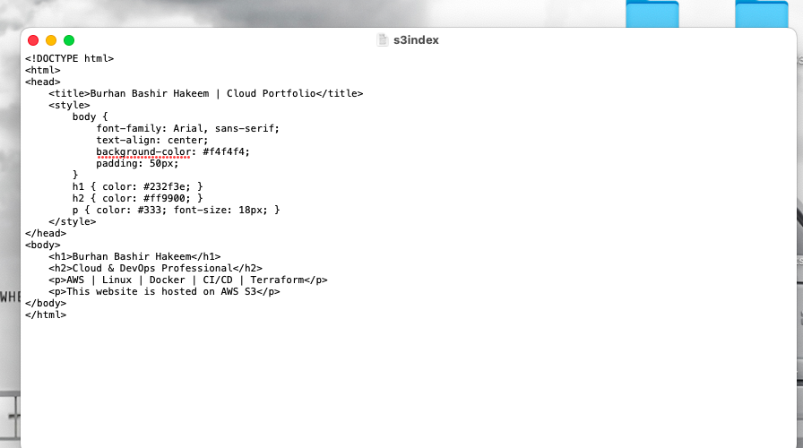
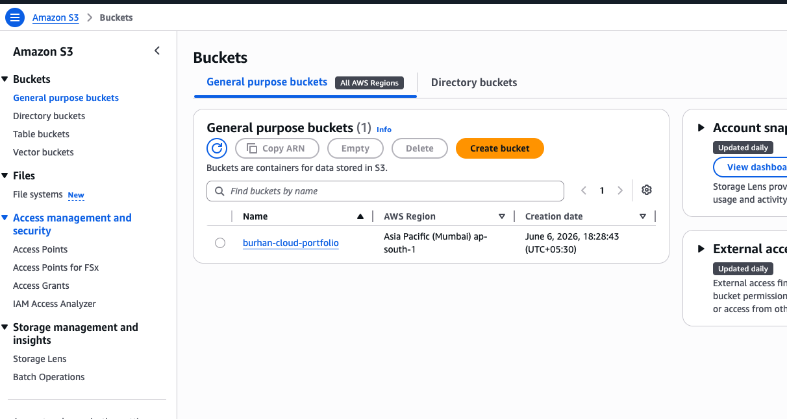
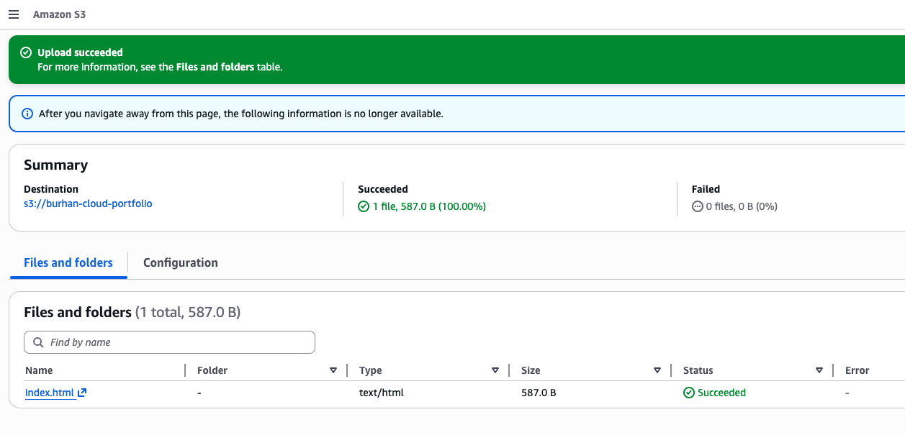
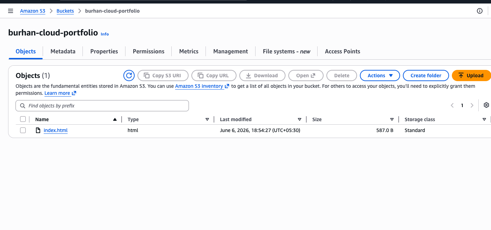
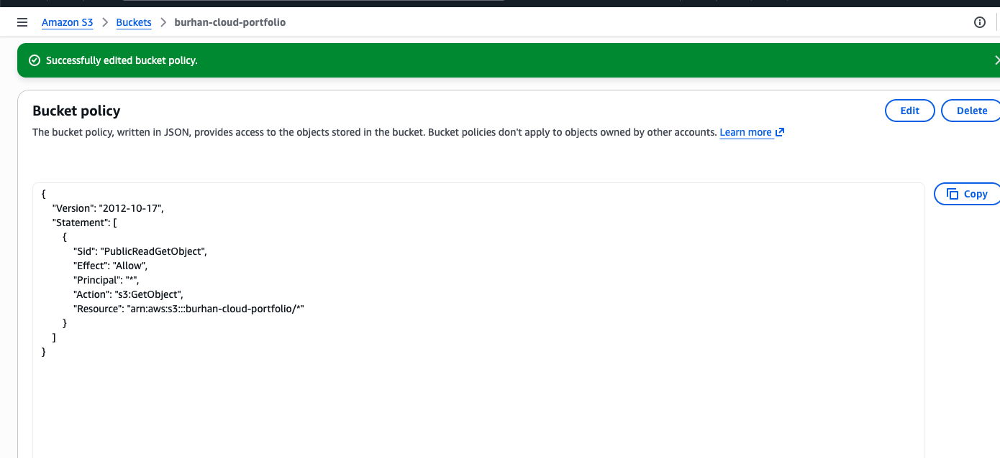
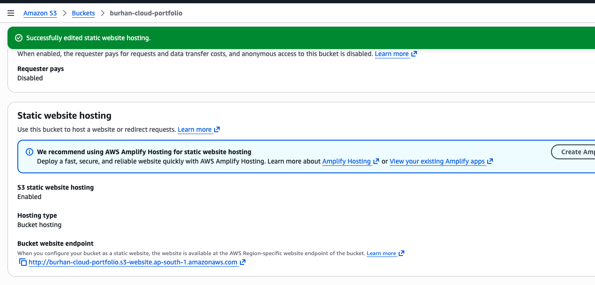
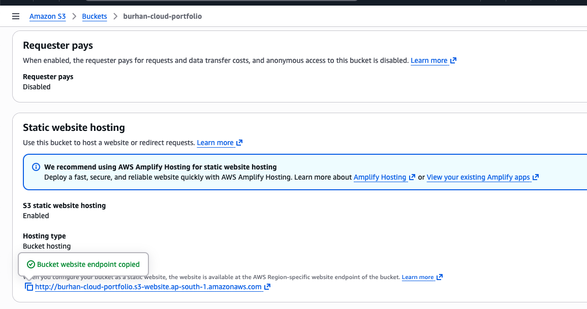
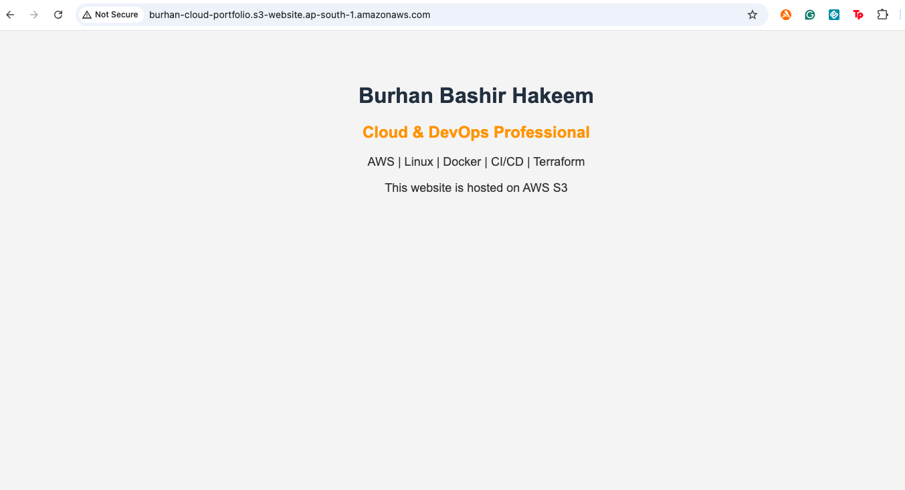

# ☁️ AWS S3 Static Website Hosting

> Deploying a static website on AWS S3 — one of the most fundamental
> skills in cloud infrastructure.

---

## 🌐 Live Website

> ✅ Successfully deployed and accessible at:

**[http://burhan-cloud-portfolio.s3-website.ap-south-1.amazonaws.com](http://burhan-cloud-portfolio.s3-website.ap-south-1.amazonaws.com)**

---

## 📋 Project Overview

This project demonstrates how to host a static website entirely on
AWS S3 — without any servers, without any backend, without any
maintenance overhead.

Static website hosting on S3 is used by thousands of companies
worldwide as a fast, reliable, and cost-effective way to serve
web content at scale.

---

## 🛠️ Technologies Used

---

## ⚙️ What I Built

A personal cloud portfolio page hosted entirely on AWS S3 —
configured with public access, static website hosting, and
a bucket policy for read permissions.

---

## 📋 Steps Performed

| Step | Action |
|------|--------|
| 1 | Wrote index.html with HTML and CSS |
| 2 | Created an AWS S3 bucket in Mumbai region |
| 3 | Uploaded index.html to the S3 bucket |
| 4 | Configured Bucket Policy for public read access |
| 5 | Enabled Static Website Hosting on the bucket |
| 6 | Copied the S3 website endpoint URL |
| 7 | Verified live website running in browser |

---

## 📸 Screenshots

### 1. HTML Code — index.html

### 2. S3 Bucket Created — Mumbai Region

### 3. File Upload Successful

### 4. index.html Inside Bucket

### 5. Bucket Policy Configured

### 6. Static Website Hosting Enabled

### 7. Website Endpoint Copied

### 8. Live Website Running on AWS

---

## 📚 Key Learnings

- How AWS S3 works as a static website hosting service
- Difference between S3 Object URL and Website Endpoint URL
- Bucket Policy configuration for public access using JSON
- Hands-on experience navigating and configuring the AWS Console
- Understanding of serverless static hosting concepts

---

## 🔑 Key AWS Concepts Covered

| Concept | Description |
|---------|-------------|
| S3 Bucket | Container for storing objects in AWS |
| Static Website Hosting | Serving HTML files directly from S3 |
| Bucket Policy | JSON based access control for S3 resources |
| Public Access | Allowing internet users to access bucket content |
| S3 Endpoint URL | The public URL generated by AWS for hosted websites |

---

## 💡 Real World Use Cases

- Hosting portfolio websites
- Serving frontend applications
- Delivering static assets at scale
- Cost-effective alternative to traditional web servers

---

## 🔗 Connect With Me

---

  <i>Part of my Cloud & DevOps portfolio — built during Advanced Certification 
  at iHUB DivyaSampark, IIT Roorkee</i>

